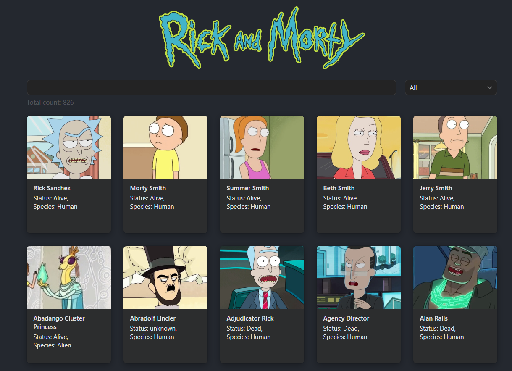
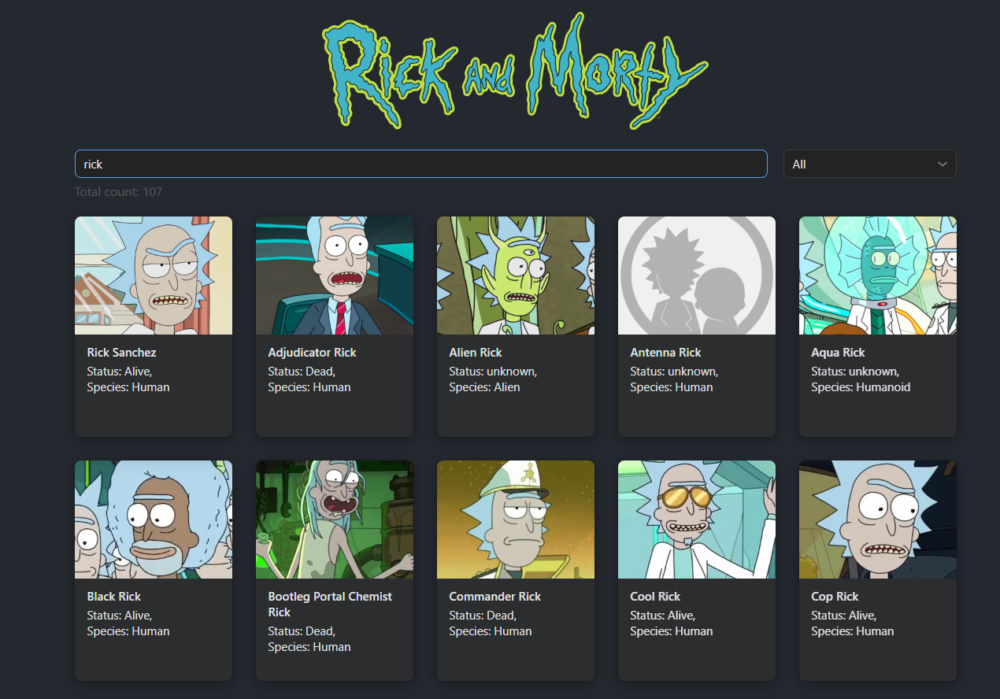
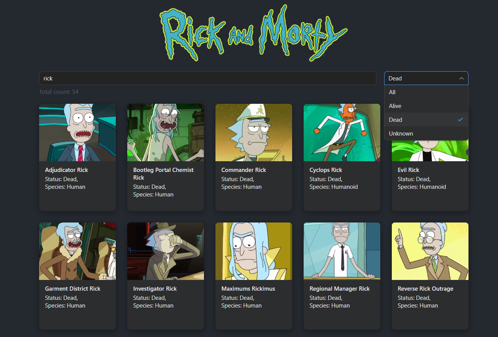
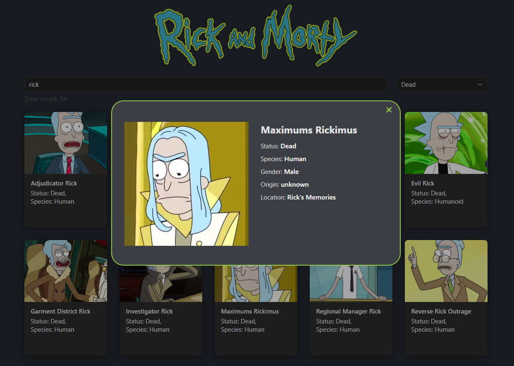
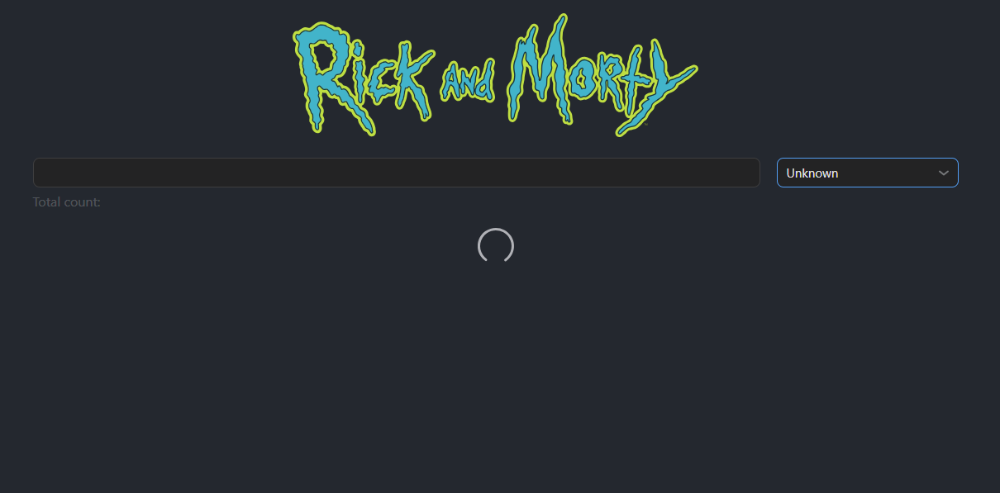
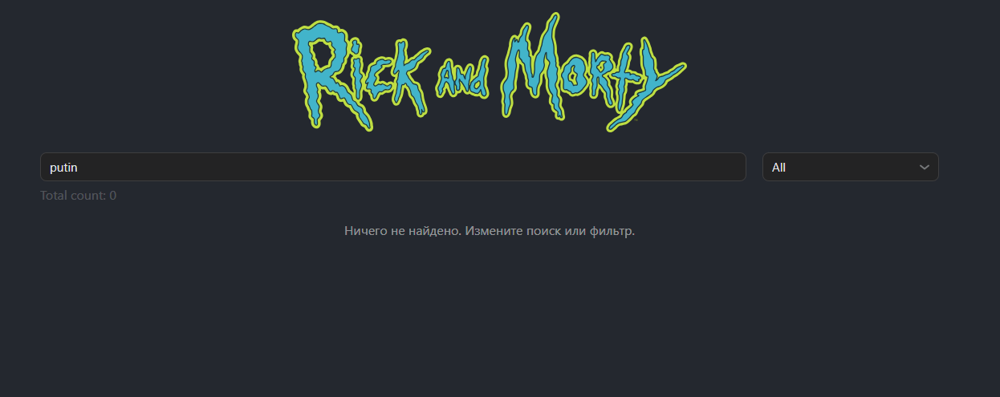
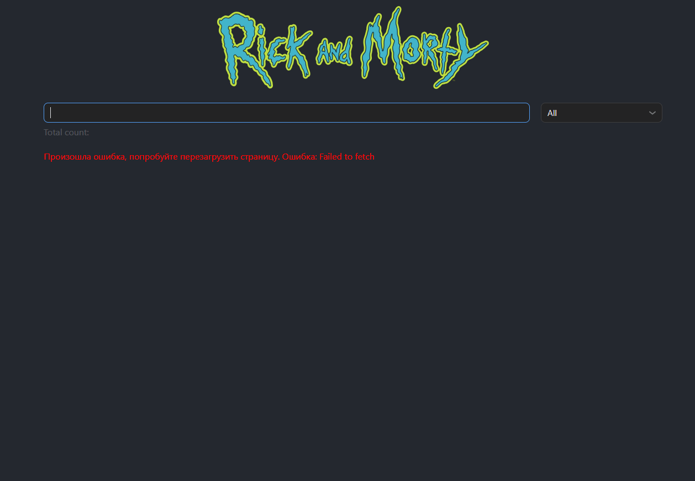
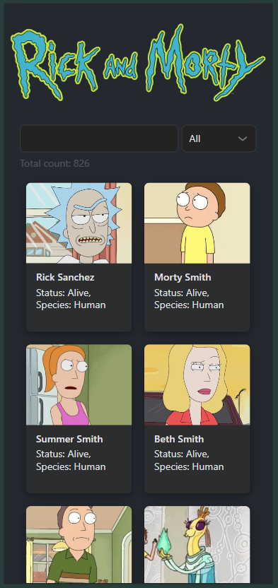
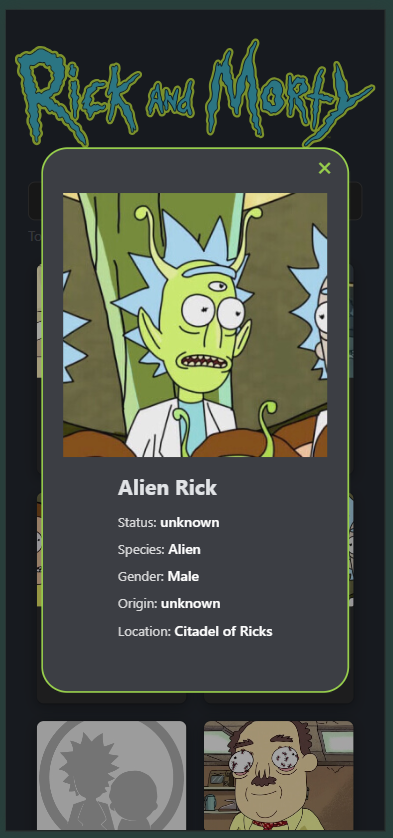
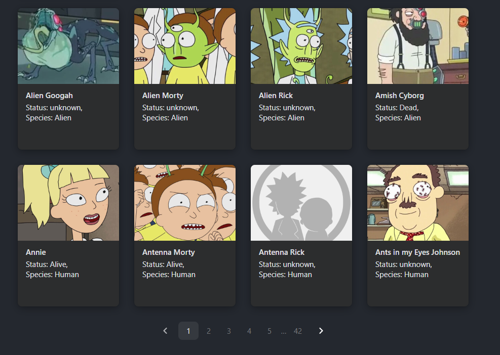

# SPA-приложение с персонажами Rick and Morty.

## !ВАЖНО: открывать лучше с VPN для лучшей работы апи

## Посмотреть страницу

- На: `https://vk-miem-test.vercel.app`

## Запуск

### Клонирование и установка

```bash
git clone https://github.com/PabloTsvetkov/vk-miem-test.git
cd vk-miem-test
npm install
```

### Запуск в дев режиме

```bash
npm run dev
```

По умолчанию приложение доступно по адресу `http://localhost:5173`.

### Билд

```bash
npm run build
```

### Превью

```bash
npm run preview
```

## Скрипты

- `npm run dev` - запуск dev-сервера
- `npm run build` - TypeScript check + продуктовый билд
- `npm run preview` - локальный просмотр production-сборки
- `npm run lint` - запуск ESLint

## Стек

- React 19
- TypeScript
- Vite
- TanStack(React) Query
- VKUI
- CSS Modules

## Фичи

- Список персонажей в карточках
- Поиск по имени (с дебаунсом)
- Фильтрация по статусу (Alive / Dead / Unknown)
- Пагинация
- Модальное окно с деталями персонажа
- Обработка состояний:
  - loading
  - error
  - empty state

## API

- [Rick and Morty API](https://rickandmortyapi.com/documentation#rest)

## Скриншоты (лежат все в папке screenshots)

### 1. Главная страница



### 2. Поиск



### 3. Фильтрация



### 4. Модальное окно персонажа



### 5. Загрузка



### 6. Пустой результат



### 7. Ошибка запроса



### 8. Мобильная главная



### 9. Мобильная модалка



### 10. Пагинация



## Структура проекта

```text
src/
  api/
  components/
    Header/
    Modal/
  pages/
    CharactersList/
  types/
  App.tsx
  main.tsx
```

## Особенности

- Часто вылетает 429 из-за апи (видимо стоят жесткие фильтры на количество запросов с одного айпишника). Мной была достигнута стабильная работа только при 10 секундах между запросами (дебаунс и для поиска, и для фильтров), но я не стал добавлять состояние для этого, потому что нет точной цифры от апи (ретраи не делаю по этой же причине). Эту проблему не стал исправлять осознанно, чтобы можно было показать обработку ошибок и потому что требуется качество "тестового"
- Обработка ошибок, пустой стейт и загрузка сделаны максимально просто для визуализации.


## Заметки

По ходу разработки велся отдельный файл с заметками и принятыми решениями:

- [Notes.md](./Notes.md)

### Заметки кратко (гпт самарайз):
1 Этап. Выбор стека
React + TypeScript и CSS Modules взял сразу, потому что это базово и удобно для меня. Из опционального изучил TanStack Query и подключил UI-kit VK, потому что оба инструмента подошли под задачу.

2 Этап. Проектирование
Приложение простое: одна страница с карточками, фильтрами, поиском, пагинацией и модалкой. На этом этапе собрал структуру проекта, настроил API-запрос и описал интерфейс персонажа.

3 Этап. Обучение
Отдельно посмотрел, как работает TanStack Query. Для задачи хватило базового понимания.

4 Этап. TanStack Query
Подключил провайдер и попробовал useQuery на главной странице. Все сразу заработало: загрузка, данные, статусы.

5 Этап. Верстка
Макет заранее не рисовал, собирал интерфейс по ходу. Настроил базовый лейаут, палитру и грид карточек через SimpleGrid.

6 Этап. Подгрузка данных
Заменил моки на реальные данные с API и добавил состояние страницы для пагинации. Потом подключил саму пагинацию и количество страниц с сервера.

7 Этап. Поиск и фильтры
Собрал поиск и фильтры через UI-kit и передал их в параметры запроса. Все заработало, но появились ошибки 429 из-за слишком частых запросов к API.

8 Этап. Правки по визуалу
Подправил отступы, выравнивания и расположение элементов. Сделал интерфейс ближе к финальному виду.

9 Этап. Модальное окно для персонажа
Сделал свою модалку вместо готовой из UI-kit. Внутри вывел данные персонажа и добавил закрытие по клику вне окна.

10. Надпись "Найдено всего"
Добавил отдельный текст с количеством найденных карточек под строкой поиска.

11. Правки по стилям
Доработал акценты, тени, радиусы и общий внешний вид. Заодно упростил шапку и оставил большое лого по центру.

12. Состояние ошибок и загрузки
Для загрузки поставил спиннер из UI-kit. Для ошибок вывожу обычный текст.

13. Небольшая чистка
Удалил лишние стили и неиспользуемые элементы. Привел проект в более аккуратный вид.

14. Деплой
Залил проект на GitHub и задеплоил на Vercel. После проверки сделал вывод, что проблема с 429 связана с ограничениями самого API.